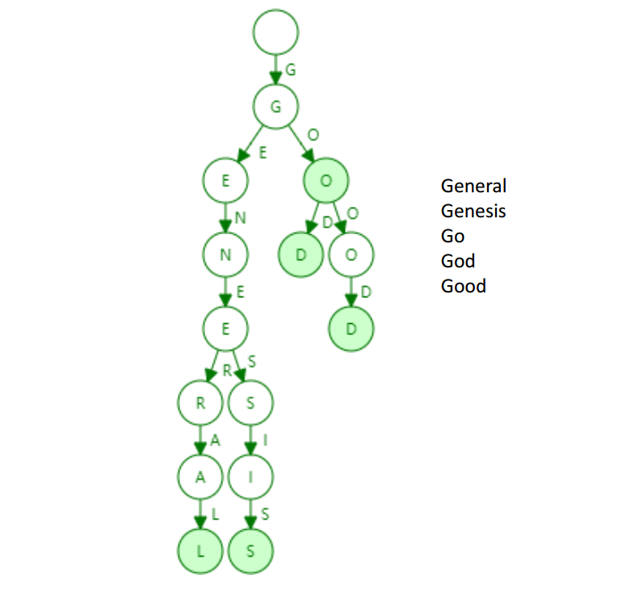
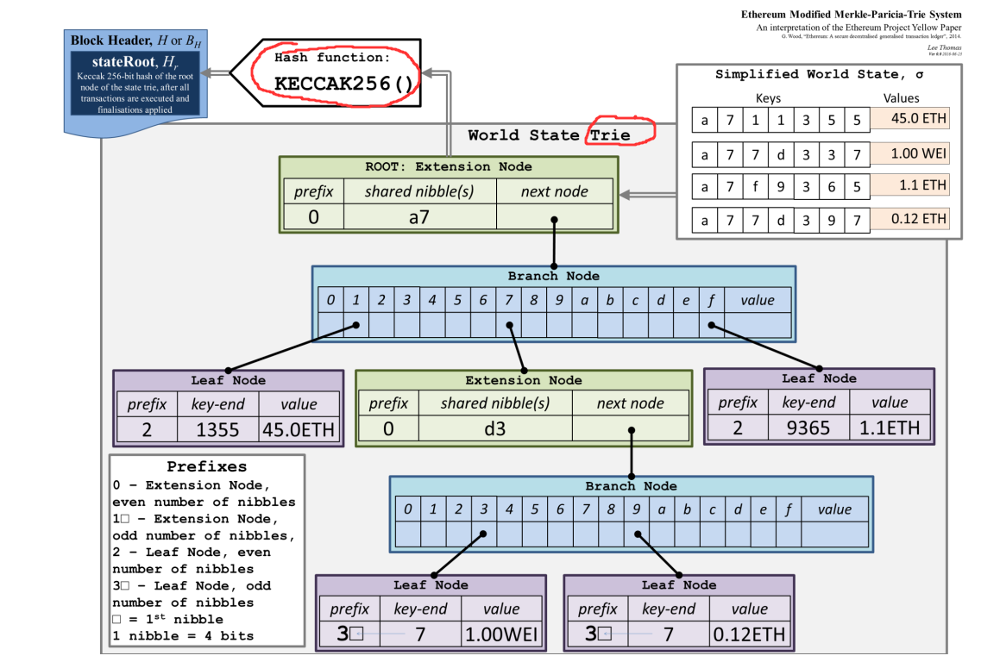
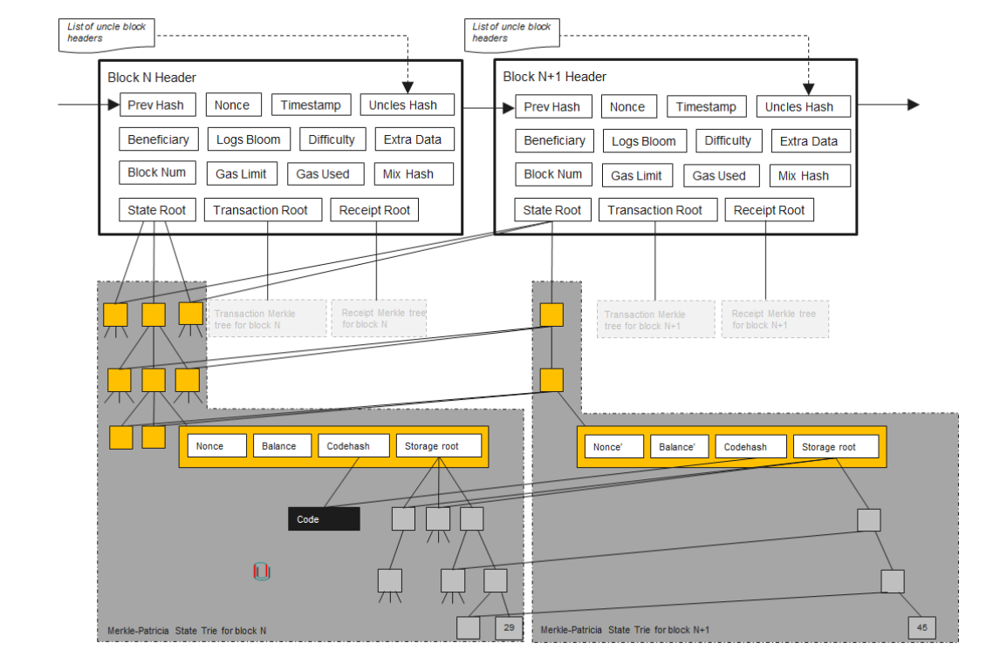
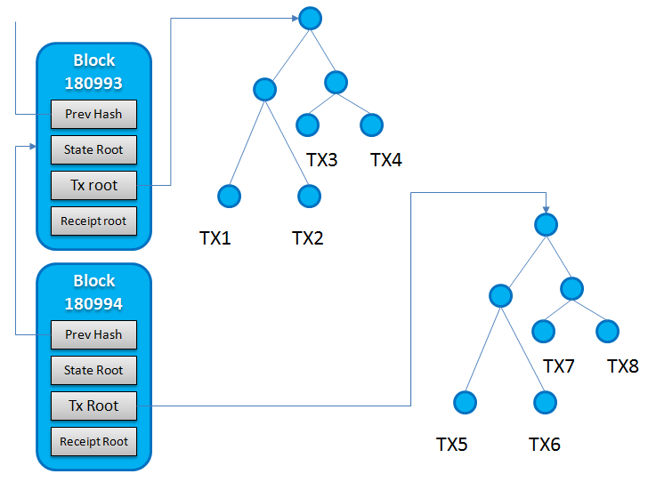
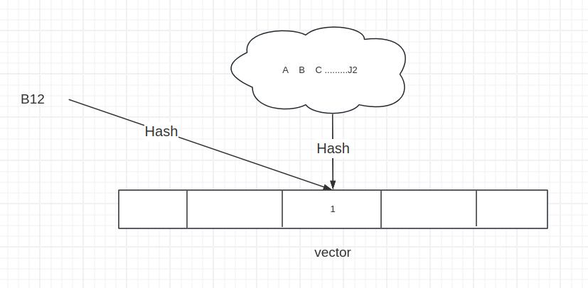
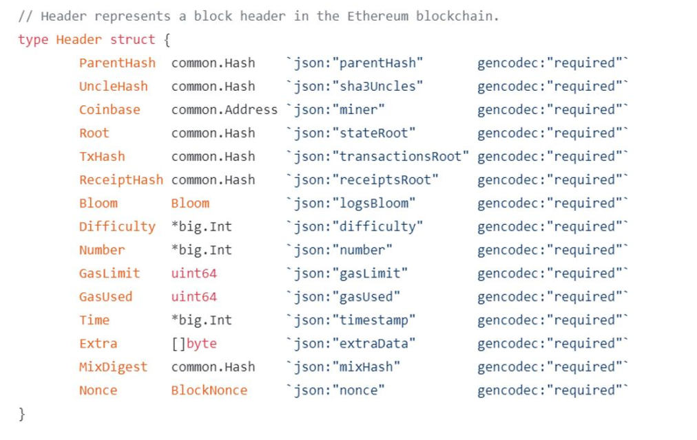
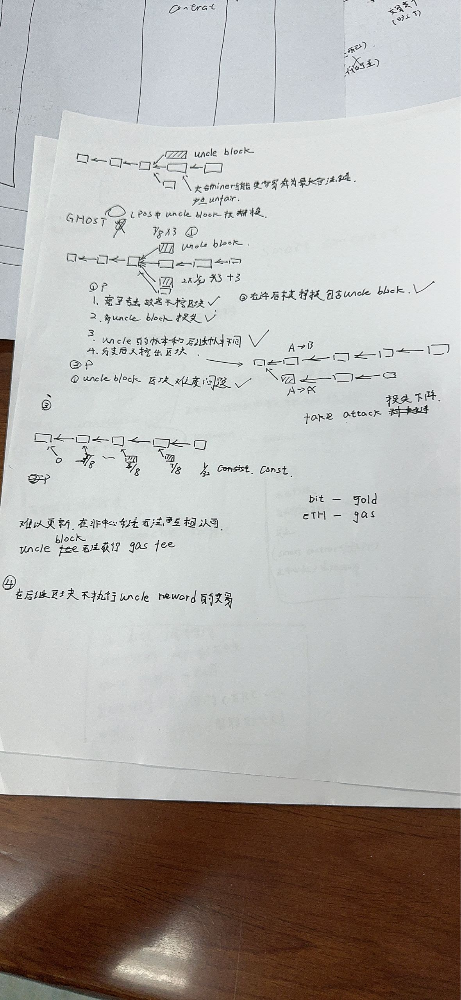
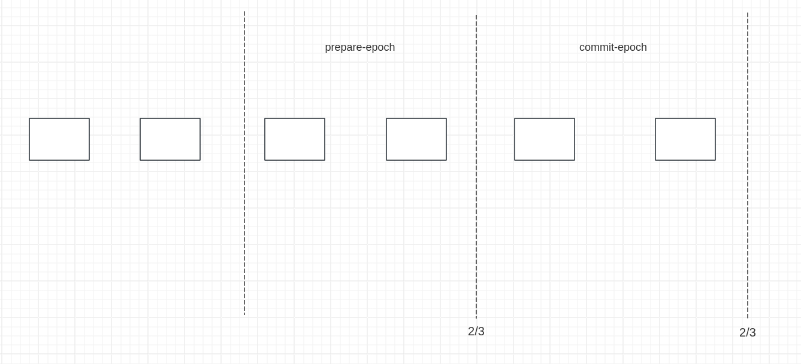
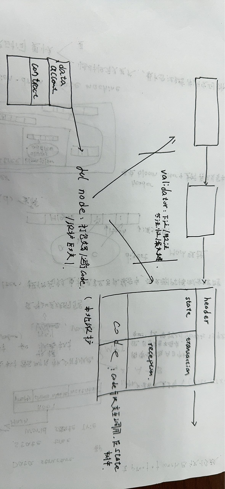

# ETH 工作原理

## 数据结构


<font size=6px>账户</font>
与Bit系统不同，ETH维护账户状态。（合约账户，外部账户）
外部账户：由公私钥对管理。
合约账户：有特定地址，由合约管理，可以编译和调用。

优势：  可以对currency精确管理，增加了金融系统的内核。

​			对于 A(3)->B 交易中如果B 账户不存在，节点需要找到创世区块中。浪费了大量资源。

劣势： replay attack（收款方生成没有收到交易）： 加入nonce计数，记录某个账户转账次数。

<font size=6px>数据结构</font>
ETH系统 每个全节点维护是三个树（状态树，交易树，收据树）

<font size=6px>Merkle-parica-Trie</font>

Trie: 数据结构


**状态树** 

由全节点维护 本地保存当前所有账户的状态。

当同步交易时，全节点根据新交易树信息计算更新本地状态树/ 而非直接copy状态信息。




```
Nonce： 此账户交易计数
Blance：账户余额
codehash：智能合约
Stroage root： 记录信息。
```

状态树 只计算一次Hash值与Merkle-tree不同。


**交易树** 
交易树同样由MPT数据结构.



当全节点收到区块后根据交易数更新状态树节点。


<font size=6px>Bloom-filter</font>
查找算法
优势:提供了高效的元素查找功能
劣势: 可能出现多个目标匹配. 删除操作出现错误(一般无法进行)



对集合中元素区hash值,并排列成向量,并在对应位置填"1" ,当出现新元素时,对其取Hash,并观察是否已经非零.

在区块链系统中 当需要查找个账户的某条交易，先在header的bloom_filter中查找，在进入交易树的bloom_filter中查找。 加快了查找速度。


<font size=6px>Header</font>



```
parenthash: 前一区块哈希值
unclehash: 
coinbase：矿工
Root：状态树根节点哈希
txhash：交易树根节点哈希
receipthash：收据树根节点哈希
bloom：查找使用
difficulty: 挖矿难度，不在使用
nunber：
Gaslimit： 运行整个区块的最多汽油量，允许每个矿工微调
Gasuesd：共使用汽油量
time：
extra：
mixdigest：
nonce： 挖矿设置。
```


## Ghost协议： 用于解决区块冲突（共识协议）
已经修改
因为ETH中降低了挖矿时间为10秒生成一次，大大增加了冲突区块的可能，比特币最长链规则不适用。 Ghost用于解决这种情况。



注意：后继节点不执行叔父区块的交易。


##  权益证明 （POS）

在区块生成后，vaildator向区块下注，验证交易合法性。根据下注结果分配权重和reward。

Validator: 推断系统共识，投票决定最长合法链，保证金决定权重。

当系统更新，验证者可以较大的影响矿工更新软体。但如果大多数矿工反对，根据规则也会扣除Validator注额。


Validator（验证者规则）： 如果恶意下注或不作为，将扣除保证金。

在区块中每50个block 进行一次投票称一个epoch 共要进行2次投票。 每次投票需要三分之二的同意才能生效。



## 智能合约
**见 课件：[智能合约](/home/liuzeyu/LifeChoice/2024-01-24/技能/block_chain/22-ETH.pdf)**

查看合约内容 ：https://etherscan.io/address/0x8881562783028f5c1bcb985d2283d5e170d88888#code

智能合约运行在EVM上。


## 反思： 
1. 维护更新困难： code is low
2. is solidity  the right programming language : 只能单线程允许，因为hash需要保存一致性。

基石：
1. 民主：修改需要多数节点同意。
2. 拥有大量eth的用户是守规的。


## 学习路线
1. solidity /javascript
2. Remix Truffle
3. 编写基础和智能合约
4. web.js 向以太坊交互。





