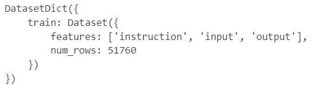

**注**：这里使用`yahma/alpaca-cleaned`为例


# 常用对象

## DatasetDict

```python
from datasets import load_dataset
# 个人喜欢通过huggingface提供的指令或者手动下载到本地
dataset_path = "your/data/path"
dataset = load_dataset(dataset_path)
```

运行结果：



## Dataset（常用）

```python
dataset = load_dataset(dataset_path, split="train") # split传入的是上述DatasetDict中的key
```


# 数据集描述函数

- load_dataset_builder

```python
from datasets import load_dataset_builder
ds_builder = load_dataset_builder(data_path)
# 主要的属性封装在info和config中
ds_builder.info.description, ds_builder.info.features
```

- get_dataset_split_names

```python
from datasets import get_dataset_split_names
get_dataset_split_names(data_path)
```

- get_dataset_config_names

```python
from datasets import get_dataset_config_names
# 有些数据集是由多个子数据集组成的，可以查看config，输出一个列表，其中的内容可以作为load_dataset的第二哥参数进行传入
config = get_dataset_config_names(data_path)
```

**注**：有些数据集是在远程仓库中存储的，上面对于的函数可以通过传入trust_remote_code来进行下载数据


# Dataset取值

## 索引取值

类似于表格的取值，分为按行取、按列取、去某个位置的元素

- 按照行

  ```
  dataset[0], dataset[-1]
  ```

- 按照列

  ```python
  dataset["input"] # 不同的数据集列名不一样
  ```

- 取数值

  ```
  dataset["input"][0]
  dataset[0]["input"]
  # 对于比较大的数据集要使用第二行的方式，第一行的方式会加载全部的数据集
  ```

  

## 切片取值

```
dataset[:3]		# 出乎意料的是返回的还是一个字典，并且key和取单条数据没有区别，只是key变成了列表
```


# 数据操作函数

## 属性

```python
dataset.num_columns # 有多少列
dataset.num_rows	# 有多少行
dataset.column_names # 列的名字，返回一个列表
dataset.shape	# （行，列）
dataset.description		# 数据集的描述
dataset.features		# 数据集的列名以及类型
```


## 列操作

- dataset.rename_column(old_name, new_name)

  - 将dataset中的列名old_name改为new_name
  - 注：针对于表格而言相当于更改了表头

- dataset.rename_columns({old_name1:new_name1, old_name2:new_name2})

  - 将传入字典中的key所指列名换成key所指的列名
  - 返回新的dataset对象

- dataset.remove_columns([column1,column2...])

  - 移除dataset中的指定的列
  - 返回新的dataset对象

- dataset.cast(datasets.features.features.Features)

  - 将dataset中的列设置为传入的Features对象

  

- dataset.cast_column(old_column, new_column_obj)

  - 将原始的dataset对象列名为old_column的类型设置成为new_column_obj

- dataset.flatten()

  - 使用场景
    - 我们所需要加载的数据集可能存在有嵌套的部分，但是我们在使用的时候需要进行展开
  - 将嵌套的部分提到上一层
  - 示例

  

  

  - 注意：嵌套的列名发生了改变

  

## 全部数据

- dataset.sort(column)

  - column是列名，会返回一个新的Dataset对象
- dataset.shuffle(seed=num, shuffle=True)

  - 返回一个打乱顺序新的Dataset对象
- dataset.train_test_split(test_size=0.2)

  - 将dataset进行训练集和测试集的划分
  - 返回的是一个DatasetDict
- dataset.select_columns([column1, column2...])

  - 将选择的列作为一个新的dataset对象返回

- dataset.repeat(num)
  - 将数据集重复num次
  - 返回新的dataset对象


## 部分数据

- dataset.select([row1,row2,...])
  - 将选择的所有row作为Dataset对象返回
- dataset.filter(function, with_indices=False)
  - 将满足特定条件的row作为Dataset对象返回
  - function可以是lambda row:函数或者function(row)
  - 也可以返回满足条件的索引，若是索引需要设置with_indices为True
- dataset.shard(num_shards=num,index=num)
  - 将dataset切分成为num_shards份，取index份
  - 返回一个新的dataset对象
- dataset.unique(column_name)
  - 将dataset某个列的唯一值返回
  - 返回一个列表

- dataset.take(num)
  - 将数据集的前num条数据组成一个新的dataset对象

- dataset.skip(num)
  - 将数据集的前num条数据跳过，后续的数据集组成一个新的dataset对象

- 

## 数据处理

### map

- 简单使用

  ```python
  from datasets import load_dataset
  
  data_path = 'your/path'
  
  dataset = load_dataset(data_path, split="train")
  
  def add_output_prefix(row):
      row["output"] = "This is a test:" + row["output"]
      return row
  
  dataset_prefix = dataset.map(add_output_prefix)
  dataset_prefix[0]
  ```

  注意：map中传入的参数需要有一个参数，其中参数代表的是数据中的每一条数据类似于dataset[index]，所以可以拿到字典中的key，从而进行数据的操作


- remove_columns = [columns_name1,columns_name2...]

  ```python
  # 去除input列
  dataset_prefix = dataset.map(add_output_prefix, remove_columns=["input"])
  ```

- with_index = True

  ```python
  dataset_prefix = dataset.map(lambda row, index:{"index":f"index","output":row["output"]})
  ```

- num_proc = num

  ```python
  # 多个进程加载数据
  dataset_prefix = dataset.map(add_output_prefix, num_proc=3)
  ```

- bached=True

  ```python
  dataset_prefix = dataset.map(add_output_prefix, batched=True)
  ```

**注**：DatasetDict也可以使用map函数，会对数据集中的所有数据进行映射处理，例可以同时处理训练集和测试集

### batch

- 简单使用

  ```python
  batch_data = dataset.batch(batch_size = 2)	# 将dataset对象中的所有数据进行分组
  batch_data[0]		# 取分组后的第一部分数据
  ```

- drop_last_batch = True

  ```python
  # 如果不能整除的话是否去掉最后一批量的数据
  batch_data = dataset.batch(batch_size=2, drop_last_batch=True)
  ```

- num_proc = num

  ```python
  # 使用多个进程读取数据
  batch_data = datase.batch(batch_size=2, drop_last_batch=False, num_proc=2)
  ```


### concatenate

#### concatenate_datasets

- 合并到列

  - 如果两个数据集中的列名类型是相同的，那么可以对这两个数据集进行合并

    ```python
    from datasets import concatenate_datasets, load_dataset
    
    stories = load_dataset("ajibawa-2023/General-Stories-Collection", split="train")
    stories = stories.remove_columns([col for col in stories.column_names if col != "text"])  # only keep the 'text' column
    wiki = load_dataset("wikimedia/wikipedia", "20220301.en", split="train")
    wiki = wiki.remove_columns([col for col in wiki.column_names if col != "text"])  # only keep the 'text' column
    
    assert stories.features.type == wiki.features.type
    bert_dataset = concatenate_datasets([stories, wiki])
    ```

- 合并到行

  - 如果两个数据集有这相同的行数，那么可以对这两个数据集进行合并

    ```python
    from datasets import Dataset
    stories_ids = Dataset.from_dict({"ids": list(range(len(stories)))})
    stories_with_ids = concatenate_datasets([stories, stories_ids], axis=1)
    ```


#### interleave_datasets

- 简单使用

  ```python
  from datasets import Dataset, interleave_datasets
  seed = 42
  probabilities = [0.3, 0.5, 0.2]
  d1 = Dataset.from_dict({"a": [0, 1, 2]})
  d2 = Dataset.from_dict({"a": [10, 11, 12, 13]})
  d3 = Dataset.from_dict({"a": [20, 21, 22]})
  dataset = interleave_datasets([d1, d2, d3], probabilities=probabilities, seed=seed)
  dataset["a"]
  ```

- stopping_strategy

  -  如果一个数据集中的数据被选完，那么就停止函数`stopping_strategy=first_exhausted`(默认)
  - 当所有的数据集中的数据都被选完的时候才会停止函数`stopping_strategy=all_exhausted`


## 保存和加载

- 保存

  ```python
  dataset.save_to_disk("path/of/my/dataset/directory")
  ```

- 加载

  ```python
  from datasets import load_from_disk
  reloaded_dataset = load_from_disk("path/of/my/dataset/directory")
  ```

  

