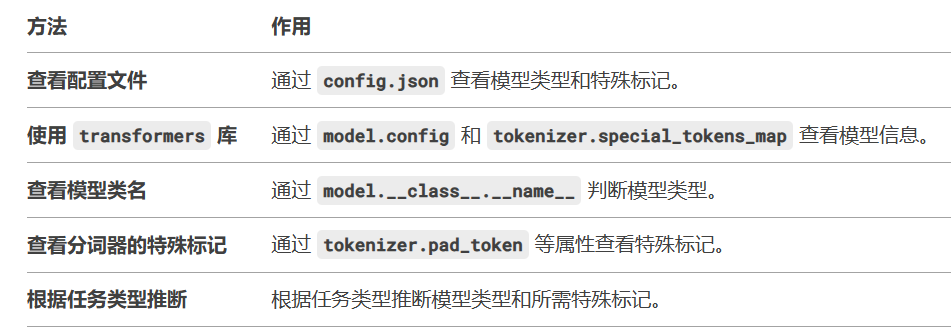

# 加载tokenizer

```python
from transformers import AutoTokenizer
tokenizer = AutoTokenizer(path)
```

# 标记

## 标记类型

|    标记    |    标记id    |               作用               |  使用场景  | 是否需要手动填充 |
| :--------: | :----------: | :------------------------------: | :--------: | :--------------: |
| pad_token  | pad_token_id |    将token的embeding进行填充     |   批处理   |       需要       |
| unk_token  | unk_token_id |   词表中不存在的token使用标记    |            |      不需要      |
| bos_token  | bos_token_id |          标记序列的开始          |  文本生成  |       需要       |
| eos_token  | eos_token_id |          标记序列的结束          |  文本生成  |       需要       |
| sep_token  | sep_token_id | 分割不同部分（两个具体拼接起来） | 句子对分类 |       需要       |
| cls_token  | cls_token_id |        标记分类任务的输出        |  分类任务  |       需要       |
| mask_token | cls_token_id |             标记掩码             |  掩码模型  |       需要       |

**注**：需要和不需要取决于特殊的使用场景，例如在进行分类任务的时候不需要添加开始标记和结束标记

## 模型所需

并不是所有的tokenizer都需要添加那么多的特殊标记，是否需要设置取决于模型结构、任务需求等

常见模型的tokenizer对于特殊标记的需求：

| 系列模型 |            所需特殊标记             | 是否需要手动设置 |             模型特点              |
| :------: | :---------------------------------: | :--------------: | :-------------------------------: |
|   BERT   | `[CLS]`, `[SEP]`, `[PAD]`, `[MASK]` |    通常不需要    |          双向编码器模型           |
|   GPT    |      `[BOS]`, `[EOS]`, `[PAD]`      |   `[PAD]`需要    |          双向编码器模型           |
|    T5    |          `[PAD]`, `[SEP]`           |    通常不需要    | 将所有 NLP 任务都视为文本生成任务 |
| RoBERTa  |      `[CLS]`, `[SEP]`, `[PAD]`      |    通常不需要    |          BERT 的改进版本          |
|  XLNet   |      `[CLS]`, `[SEP]`, `[PAD]`      |    通常不需要    |          自回归和自编码           |

**注**：基本上只需要判断pad是否需要添加即可，对于某个特定任务来说tokenizer会自动将必须的特殊标记所添加

查看模型类型的方法：




## 查看是否定义

- 方式一：

  ```
  tokenizer.special_tokens_map # 返回一个字典，字典中显示tokenizer中定义的所有特殊标记
  ```

- 方式二：

  ```
  tokenizer.all_special_tokens # 返回一个列表，列表中显示tokenizer中定义的所有特殊标记
  ```

**注**：不仅仅只有这两种方式，上面两种是比较直观的方式


## 怎么添加

- 方式一：通过tokenizer.add_special_tokens()函数添加

  ```
  if tokenizer.pad_token is None:
      tokenizer.add_special_tokens({'pad_token': '[PAD]'})
  
  print(tokenizer.pad_token)  # 输出: [PAD]
  print(tokenizer.pad_token_id)  # 输出: 对应的 ID
  ```

- 方式二：通过修改tokenizer的配置文件进行修改

  ```json
  {
      "pad_token": "[PAD]",
      "pad_token_id": 50258
  }
  ```

  **注**：不一定在下载模型的时候都会有tokenizer的配置文件

- 方式三：toeknizer.特殊标记编号=字典中存在的某个数字

  ```
  tokenizer.pad_token_id = 0
  vocab = tokenizer.get_vocab() # 获取词表后查看0是否适合作为pad_id
  vocab = tokenizer.vocab # 返回的是一个字典，其中键是token，值是id
  ```

  **注**：使用上面的设置方式要确定词典中的0是适合作为pad

### 例子
- 当我们想添加一个特殊的tokens： [Gaze],比如当生成这个token时模型可以自动调用眼动追踪。
我们可以应该如下设置
```
1. 将[Gaze]添加到tokenizer的词汇表中
tokenizer.add_special_tokens({'Gaze': ['[Gaze]']})
2. 修改文本时，将[Gaze]添加到文本中
text = "模型可以自动调用眼动追踪[Gaze]"
encoding = tokenizer(text，return_tensors='pt')
encoding=tokenizer.encoder(text)
3. 扩展模型embeding层
model.resize_token_embeddings(len(tokenizer))
4. 模型会识别并学习这个特殊的tokens
```


# 填充

作用：填充编码是的位置

## 填充位置

- 左侧填充

  - 使用场景
    - 因果语言模型
    - 解码器（decoder-only）
  - 使用示例

  ```python
  tokenizer = AutoTokenizer.from_pretrained("gpt2")
  tokenizer.padding_side = "left"  # 适合生成任务
  ```

  

- 右侧填充

  - 使用场景
    - 双向语言模型
    - 编码器（encoder-only）
  - 使用示例

  ```python
  tokenizer = AutoTokenizer.from_pretrained("bert-base-uncased")
  tokenizer.padding_side = "right"  # 适合理解任务
  ```


## 填充方式

- 动态填充

  - 使用场景
    - 输入序列的长度差比较大时
    - 常用于训练阶段
  - 使用示例

  ```python
  encoded_inputs = tokenizer(texts, padding=True, return_tensors="pt")
  ```

  **注**：不可以批量给模型，每个batch中最大长度不一样

- 固定长度填充

  - 使用场景
    - 对齐到固定的长度
    - 常用于批处理
  - 使用示例

  ```python
  encoded_inputs = tokenizer(texts, padding='max_length', max_length=128, return_tensors="pt")
  ```

  

- 分块填充

  - 定义：将长序列分成多个固定长度的块，并对每个块进行填充
  - 使用场景
    - 当输入序列长度大于模型可以接收的最大长度时
    - 常用于处理长文本
  - 使用示例

  ```python
  def chunk_and_pad(text, chunk_size=512):
      tokens = tokenizer.encode(text, add_special_tokens=False)
      chunks = [tokens[i:i + chunk_size] for i in range(0, len(tokens), chunk_size)]
      padded_chunks = [chunk + [tokenizer.pad_token_id] * (chunk_size - len(chunk)) for chunk in chunks]
      return padded_chunks
  ```

  

- 掩码填充

  - 定义：在填充的时候生成一个掩码来区分有效token和填充token
  - 使用场景
    - 常用于训练阶段，掩码可以防止模型关注填充的token
  - 使用示例

  ```python
  encoded_inputs = tokenizer(texts, padding=True, return_attention_mask=True, return_tensors="pt")
  ```

  **注**：默认情况下return_attention_mask为True

- 截断（常用）

  - 使用场景
    - 序列长度超过模型可以接收的最大长度
    - 常用于处理长文本
  - 使用示例

  ```python
  encoded_inputs = tokenizer(texts, truncation=True, max_length=512, padding="max_length", return_tensors="pt")
  ```

  **注**：需要传入truncation和max_length参数


# 字典

- **`tokenizer.vocab`**
  - 返回分词器的词汇表，形式为一个字典，其中键是 token，值是对应的 ID。

- **`tokenizer.vocab_size`**
  - 返回分词器的词汇表大小
- **`tokenizer.get_vocab()`**
  - 返回分词器的词汇表


# 转化

## 常用函数

- **`tokenizer.tokenize()`**
  - 将文本分割为token（也就是转化成为一个列表，其中每一个后面会转化成为一个ids）
- **`tokenizer.encode()`**
  - 将文本转化为token IDS
  - 不会带有掩码信息，只包含ids信息
- **`tokenizer.decode()`**
  - 将 token IDs 转换回文本
- **`tokenizer()`**
  - 将文本编码为模型输入格式（包括 `input_ids`、`attention_mask` 等）
- **`tokenizer.convert_tokens_to_ids()`**
  - 将 token 列表转换为 token IDs
- **`tokenizer.convert_ids_to_tokens()`**
  - 将 token IDs 转换为 token 列表


## 区别

tokenizer.encode()：

- 将**原始文本**直接转换为 token IDs。
- 内部会调用 `tokenizer.tokenize()` 和 `tokenizer.convert_tokens_to_ids()`，并可能添加特殊 token（如 `[CLS]`、`[SEP]` 等）。

tokenizer.convert_tokens_to_ids():

- 将**token 列表**转换为 token IDs。
- 不会添加任何特殊 token，只是将 token 映射为对应的 ID。

**注意**：tokenizer.decoder()和tokenizer.convert_ids_to_tokens()的区别相似


# 其他

## 存储和加载

- 存储

  - **`tokenizer.save_pretrained()`**

  ```python
  tokenizer.save_pretrained("path/to/save")
  ```

- 加载

  - **`tokenizer.from_pretrained()`**

  ```python
  tokenizer = AutoTokenizer.from_pretrained("bert-base-uncased")
  ```

  

## 最大长度

**`tokenizer.model_max_length`**：返回模型支持的最大输入长度。


## 配置信息

**`tokenizer.init_kwargs`**：返回tokenizer的配置信息
