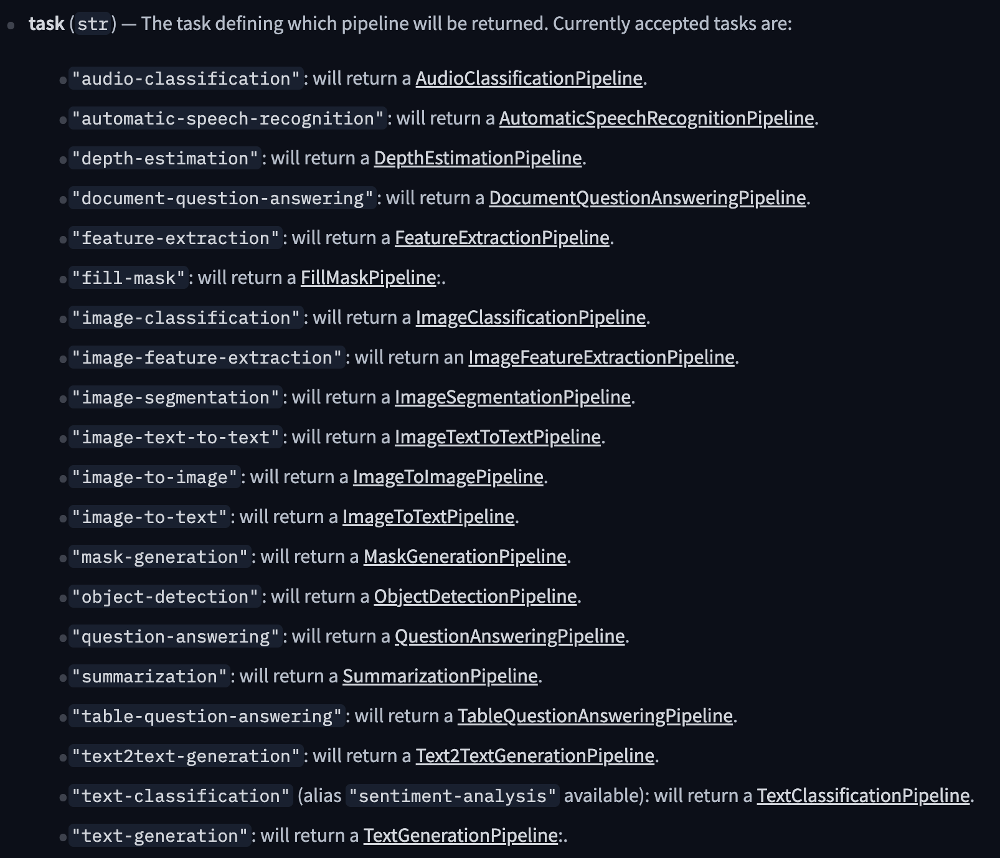
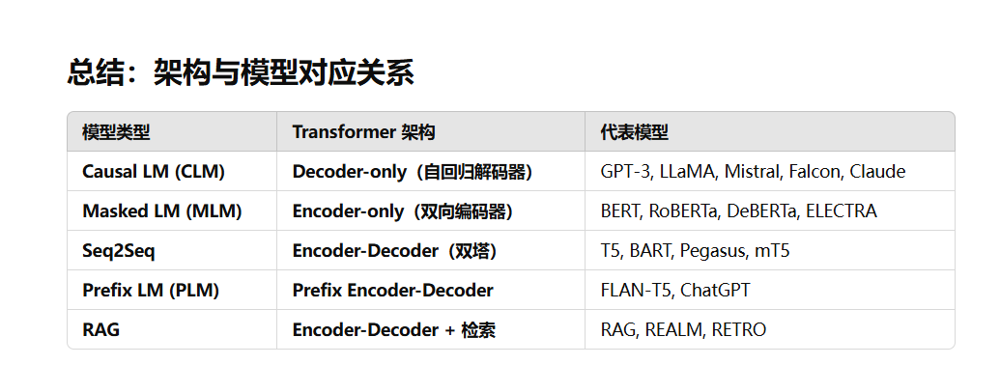

# 快速开始

## Pipeline
- pipeline 是 Hugging Face 提供的任务级接口，让你无需关心模型细节即可完成诸如文本分类、问答、翻译、摘要、生成等任务。
- pipline 允许多种任务类型

- 只传入一个任务类型

```python
from transformers import pipeline
classifier = pipeline("sentiment-analysis")
# 如果传入的只有一条那么就传入字符串，如果是多条的话就都放在一个列表中
results = classifier(["We are very happy to show you the 🤗 Transformers library.", "We hope you don't hate it."])
for result in results:
    print(f"label: {result['label']}, with score: {round(result['score'], 4)}")
```

- 传入特定的model和tokenizer

```python
from transformers import AutoTokenizer, AutoModel, pipeline
model_name = "your/model/path"
model = AutoModel.from_pretrained(model_name)
tokenizer = AutoTokenizer.from_pretrained(model_name)
classifier = pipeline("sentiment-analysis", model, tokenizer)
# 注意 model和 tokenizer 载入的model_name 需要匹配
```

## AutoClass

### AutoTokenizer

已经做过详细的介绍

### AutoModel

transformers提供了一个简单统一的方法来对模型进行加载，可以像使用AutoTokenizer一样使用AutoModel，唯一需要注意的是，我们需要为不同的任务选择不同的加载类，比如对于文本分类，需要选择`AutoModelForSequenceClassification`

默认情况下会使用torch.float32进行模型的加载，如果传入参数torch_type='auto'，那么就会按照模型中的配置文件来确定模型的精度


### save model

```python
save_path = 'your/model/path'
tokenizer.save_pretrained(save_path)
model.save_pretrained(save_path)
```


## Custom model builds

- 修改预训练模型中的特定参数

  ```python
  from transformers import AutoConfig
  
  my_config = AutoConfig.from_pretrained("your/model/path", n_heads=12)
  ```

- 加载模型

  ```python
  from transformers import AutoModel
  
  my_model = AutoModel.from_config(my_config)
  ```

  

## Trainer

1. 加载一个预训练模型

   ```python
   from transformers import AutoModel
   model = AutoModel.from_pretrained("your/model/path")
   ```

2. 定义`TrainingArguments`，包含了模型训练时候的超参数

   ```python
   from transformers import TrainingArguments
   # 如果没有传入的话将会使用默认值
   training_args = TrainingArguments(
       output_dir="path/to/save/folder/",
       learning_rate=2e-5,
       per_device_train_batch_size=8,
       per_device_eval_batch_size=8,
       num_train_epochs=2,
   )
   ```

3. 加载编码器

   ```python
   from transformers import AutoTokenizer
   
   tokenizer = AutoTokenizer.from_pretrained("your/tokenizer/path")
   ```

4. 加载数据集

   ```python
   from datasets import load_dataset
   dataset = load_dataset("dataset/name")
   ```

5. 定义处理函数并且将数据集中的元素转化成为数值数据

   ```python
   def tokenize_dataset(example):
       # 这里返回的是数据集中一条元素要被tokenize的元素
       return ....
   dataset = dataset.map(tokenize_dataset, batched=True)
   ```

6. 对数据进行填充，填充后模型可以使用

   ```python
   from transformers import DataCollatorWithPadding
   data_collator = DataCollatorWithPadding(tokenizer=tokenizer)
   ```

7. 定义Trainer并且开始训练

   ```python
   from transformers import Trainer
   
   trainer = Trainer(
       model=model,
       args=training_args,
       train_dataset=dataset["train"],
       eval_dataset=dataset["test"],
       processing_class=tokenizer,
       data_collator=data_collator,
   )
   # 开始对模型进行训练
   trainer.train()
   ```

# 教程

## 使用Piplines进行推导

### 通用

```
pipeline可以传入的参数
- task			# 任务类型
- model			# 特定的model是一个path
- tokenizer		# 特定的tokenizer是一个path
- torch_dtype	# 加载模型的权重类型，设置auto会根据配置文件进行加载
- device		# GPU编号
- batch_size	# 批量大小
- other			# 不同的任务类型可以传入的额外参数不同
```

### 如何确定其他可以传入的参数？

试试pipline.config


### 使用accelerate 

```python
pipe = pipeline(model="facebook/opt-1.3b", device_map="auto", model_kwargs={"load_in_8bit": True})
# device_map="auto" => 自动映射到可以使用的设备上
# "load_in_8bit":True => 下载bitsandbytes可以进行量化
```

**注**：device_map = "auto"通常是在推断的时候使用


## 微调预训练模型

### 使用Trainer

**注**：上面Trainer的章节简单说明了怎么对一个模型进行训练，但是对于完整的训练模型还缺少评估的部分，这个部分将对此进行补充

- 首先需要对于不同的任务选定不同的指标

- 确定评估函数

  ```python
  def compute_metrics(eval_pred):
      logits, labels = eval_pred
      predictions = np.argmax(logits, axis=-1)
      return metric.compute(predictions=predictions, references=labels)
  ```

  

- 配置TrainingArguments中评估的相关参数

- 将评估函数作为参数传入Trainer

  ```python
  trainer = Trainer(
      model=model,
      args=training_args,
      train_dataset=small_train_dataset,
      eval_dataset=small_eval_dataset,
      # 评估函数
      compute_metrics=compute_metrics,
  )
  ```

  


### 使用原生pytorch

1. 对于数据的处理

   - 若没有使用datasets库，也就是没有返回Dataset对象，那么需要手写Dataset
   - 可以直接和datasets库中的Dataset对象进行适配

2. 创建DataLoader

   ```python
   from torch.utils.data import DataLoader
   
   train_dataloader = DataLoader(train_data, shuffle=True, batch_size=8)
   test_dataloader = DataLoader(test_data, shuffle=False, batch_size=8)
   # 如果train_data还没有经过tokenize那么需要传入处理的函数
   ```

3. 准备模型，优化器，调度器

   ```python
   from torch.optim import AdamW
   from transformers import AutoModelFor...
   from transformers import get_scheduler
   
   model = AutoMolFor....from_pretrained('your/model/path')
   optimizer = AdamW(model.parameters(), lr=5e-5)
   num_epochs = 3
   num_training_steps = num_epochs * len(train_dataloader)
   lr_scheduler = get_scheduler(
       name="linear",
       optimizer=optimizer,
       num_warmup_steps=300,
       num_training_steps=num_training_steps
   )
   # 将模型移动到device
   model.to(device)
   ```

4. 训练代码

   ```python
   from tqdm.auto import tqdm
   # 进度条
   process_bar = tqdm(range(num_training_steos))
   model.train()
   for epoch in range(num_epochs):
       for batch in train_dataloader:
           batch = {k:v.to(device) for k, v in batch.items()}
           outputs = model(**batch)
           loss = outputs.loss
           loss.backward()
           optimizer.stemp()
           lr_scheduler.step()
           optimizer.zero_grad()
           process_bar.update(1)
   ```

5. 评估代码

   ```python
   import evaluate
   
   metric = evaluate.load("accuracy")
   
   model.eval()
   for batch in test_dataloader:
       batch = {k:v.to(device) for k, v in batch.items()}
       with torch.no_grad():
           output = model(**batch)
       logits = output.logits
       predictions = torch.argmax(logits, axis=-1)
       metric.add_batch(predictions=predictions, references=batch["labels"])
   
   metric.compute()
   ```


### 使用accelerate进行分布式训练

- 第一步创建Accelerate对象
- 对模型、优化器，DataLoader进行包装
- 反向传播的时对loss进行特殊处理
- 使用accelerate指令进行启动

```python
from accelerate import Accelerator

# ...导包

# 1.初始化Accelerate
accelerator = Accelerator()

# 模型不要往特定的设备上放
model = AutoModelFor....from_pretrained('your/model/path')
optimzer = AdamW(model.parameters(),lr=3e-5)

model, optimizer, train_dataloader, test_dataloader = accelerator(model, optimizer, train_dataloader, test_dataloader)

### 下面的代码和上面使用原生pytorch训练的代码有微小差别
from tqdm.auto import tqdm
# 进度条
process_bar = tqdm(range(num_training_steos))
model.train()
for epoch in range(num_epochs):
    for batch in train_dataloader:
        # 不要往device上放
        # batch = {k:v.to(device) for k, v in batch.items()}
        outputs = model(**batch)
        # 如果使用accelerate进行分布式训练的话outputs.loss需要一个数值进行接收
        loss = outputs.loss
        # 不要使用下面的方式进行反向传播
        # loss.backward()
        accelerator.backward(loss)
        optimizer.stemp()
        lr_scheduler.step()
        optimizer.zero_grad()
        process_bar.update(1)
```

**注**：如果使用Trainer进行分布式训练只需要在TrainingArugment设定ddp_find_unused_parameters即可


## 使用PEFT加载和训练适配器

具体peft支持的高效微调方法请在peft笔记中寻找

1. 准备模型

   ```python
   from transformers import AutoModelForCasualLM, AutoTokenizer, BitsAndBytesConfig
   
   model_id = "your/model/name or path"
   model = AutoModelForCasualLM.from_pretrained(model_id)
   # 使用量化加载
   model = AutoModelForCausalLM.from_pretrained(peft_model_id, quantization_config=BitsAndBytesConfig(load_in_8bit=True))
   
   ```

2. 加载adapter

   ```python
   peft_model_id = "your/adapter/name or path"
   model.load_adapter(peft_model_id)
   ```

3. 像模型中添加adapter

   ```python
   from peft import LoraConfig
   lora_config = LoraConfig(
       target_modules=["q_proj", "k_proj"],
       init_lora_weights=False
   )
   
   # 添加一个名字是adapter_1的lora adapter
   model.add_adapter(lora_config, name="adapter_1")
   # 添加一个名字是adapter_2的lora adapter
   model.add_adapter(lora_config, name="adapter_2")
   ```

4. 选择要激活的adapter(一次只能有一个adapter处于激活状态)

   ```python
   # 这里选择name = "adapter_1"同样也可以选择name="adapter_2"
   model.set_adapter("adapter_1")
   model.generate(**input)
   print(tokenizer.decode(output_disabled[0], skip_special_tokens=True))
   ```

5. 激活和禁用adapter

   ```python
   # 这里的model指的是peftmodel
   model.enable_adapters()
   # 禁用
   model.disable_adapters()
   ```

6. 训练

   ```python
   # model指的是PeftModel
   trainer = Trainer(model=model,...)
   trainer.train()
   ```

7. 保存和加载

   - 加载有这adapter的model

   ```python
   # 这里的model是已经使用Trainer训练过的
   model.save_pretrained(save_dir)
   
   model = AutoModelForCausalLM.from_pretrained(save_dir)
   ```

   - 加载没有adapter的model

   ```python
   from peft import PeftConfig, PeftModel
   base_model = AutoModelForCasualLM.from_pretrained(model_id)
   lora_adapter_id = "your/adapter/name or path"
   
   lora_config = PeftConfig.from_pretrained(lora_adapter_id)
   
   peft_model = PeftModel.from_pretraied(base_model, lora_config)
   ```

8. 可以将原始模型的其他层参与到模型的训练并且保存权重

   ```python
   lora_config = LoraConfig(
       target_modules=["q_proj", "k_proj"],
       # 需要传入的参数
       modules_to_save=["lm_head"],
   )
   ```

   

## agent

## generate函数

### 基本使用

1. 加载模型和分词器

   ```python
   from transformers import AutoModelForCasualLM, AutoTokenizer
   
   tokenizer = AutoTokenizer.from_pretrained("tokenizer_id")
   model = AutoModelForCasualML.from_pretrained("model_id")
   ```

2. 生成文本

   ```python
   model_inputs = tokenizer("what you want to ask", return_tensors="pt").to(device)
   
   # 默认情况下的最大长度是20
   generate_ids = model.generate(**model_inputs)
   response = tokenizer.decode(generate_ids,skip_special_tokens=True)[0]
   ```


### 常见坑

- 控制生成文本的长度

  ```python
  model.generate(**model_inputs, max_new_tokens=nums)
  ```

- 不正确的生成方式(对于同一个问题每次输出的答案是一致的，没有创造性)

  ```python
  model.generate(**model_inputs, do_sample=True)
  ```

- 错误的填充侧

  ```python
  # 对于decode-only架构的模型训练的时候pad要选择right，推断的时候pad需要选择left，generate函数用于推断
  tokenizer = AutoTokenizer.from_pretrained("tokenizer_id", return_tensors="pt",padding_side="left")
  tokenizer.pad_token = tokenizer.eos_token		# 很多的LLM没有特殊的填充token
  ```

- 错误的prompt

  - 对于一些特殊的模型如果不使用它指定的模板，那么模型的性能就会下降

    ```python
    messages = [
        {
            "role": "system",
            "content": "You are a friendly chatbot who always responds in the style of a thug",
        },
        {"role": "user", "content": "How many helicopters can a human eat in one sitting?"},
    ]
    model_inputs = tokenizer.apply_chat_template(message, add_generation_prompt=True,max_new_tokens=20)
    generated_ids = model(**model_inputs)
    response = tokenizer.batch_decode(generated_ids, skip_special_tokens=True)
    ```


## 和transformers进行聊天

### 简单使用

如果你可以给模型传入一个历史的聊天记录，那么模型可以可以基于你传入的历史接着给你回复

1. 历史记录

   ```python
   chat = [
       {"role": "system", "content": "You are a sassy, wise-cracking robot as imagined by Hollywood circa 1986."},
       {"role": "user", "content": "Hey, can you tell me any fun things to do in New York?"}
   ]
   ```

2. 使用pipline加载模型

   ```python
   import torch
   from transformers import pipline
   
   # 使用半精度加载模型
   pipe = pipline(task=text-generation,model="model_id",torch_dtype=torch.bfloat16, device_map="auto")
   
   response = pipe(chat, max_new_tokens=512)
   chat = response[0]['generated_text']
   chat.append(
       {"role": "user", "content": "Wait, what's so wild about soup cans?"}
   )
   response = pipe(chat, max_new_tokens=512)
   ```


### 如何选择模型

- 模型尺寸
- 查看模型排行榜
- 特定的领域（任务）


### pipeline内部怎么运行的

**注**：对比简单使用中使用pipeline进行推断

```python
from transformers import AutoModelForCausalLM, AutoTokenizer
import torch

chat = [
    {"role": "system", "content": "You are a sassy, wise-cracking robot as imagined by Hollywood circa 1986."},
    {"role": "user", "content": "Hey, can you tell me any fun things to do in New York?"}
]

# 1: 加载模型和分词器
model = AutoModelForCausalLM.from_pretrained("meta-llama/Meta-Llama-3-8B-Instruct", device_map="auto", torch_dtype=torch.bfloat16)
tokenizer = AutoTokenizer.from_pretrained("meta-llama/Meta-Llama-3-8B-Instruct")

# 2: 应用chat模板
formatted_chat = tokeinzer.apply_chat_template(chat, tokenize=False, add_generation=True)

# 3: 转化为模型可以使用的数据
inputs = tokenizer(formatted_chat, add_special_tokens=False, return_tensors="pt")
inputs = {k:v.to(device) for k, v in inputs.items()}

# 4: 使用模型进行推断
outputs = model.generate(**inputs, max_new_tokens=512, temperature=0.1)

# 5: 解码
decoded_output = tokenizer.decode(outputs[0][inputs['input_ids'].size(1):], skip_special_tokens=True)

```


## 补充

模型类型和模型架构之间的对应关系（GPT给出）




